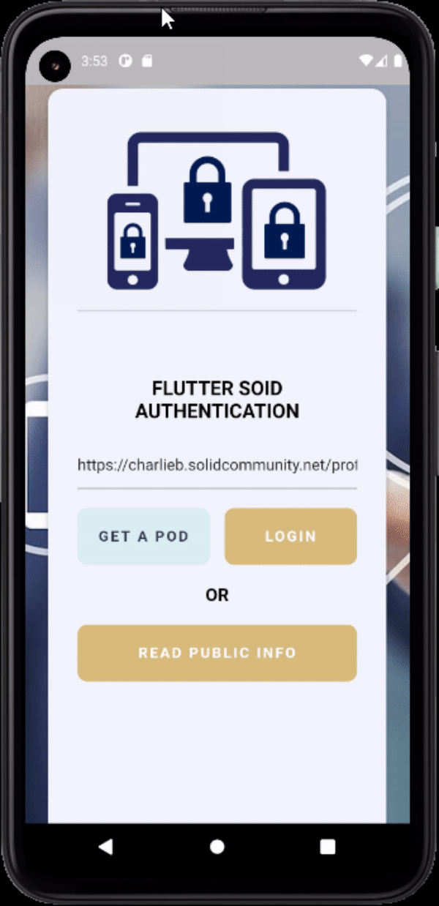
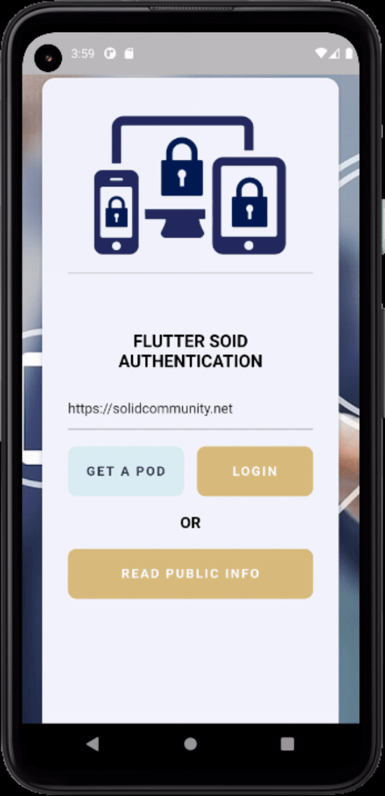
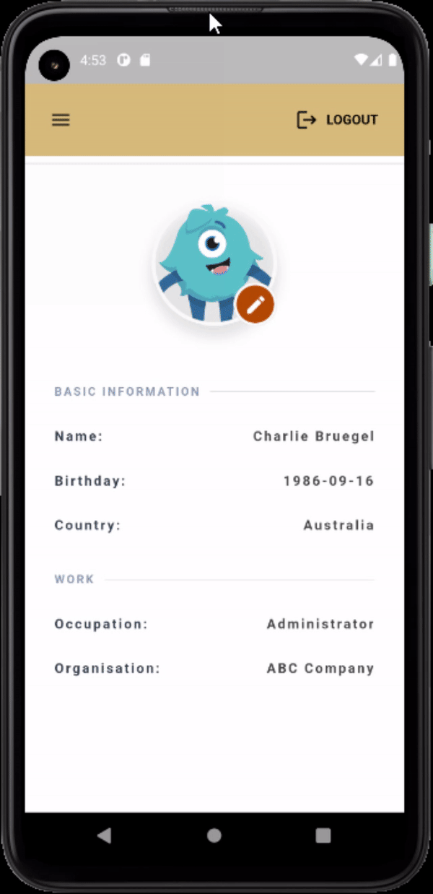
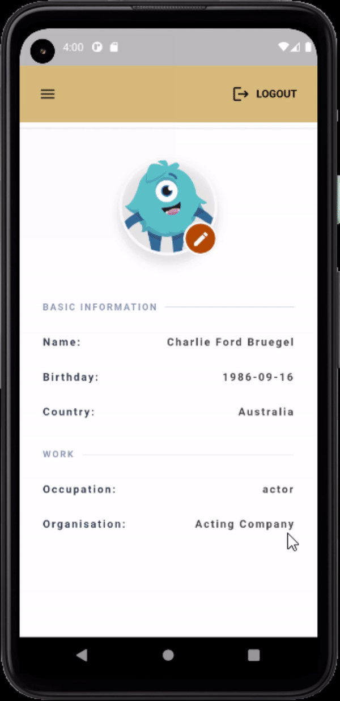

# A demo app for using Solid Auth package

Flutter Demo app for authenticate with Solid PODs. The app can run on both mobile (tested on Anroid) and web platforms (tested on Chrome and Firefox).

<!-- **Flutter packages used in the app:**

- json_annotation
- uni_links: ^0.5.1
- url_launcher: ^6.0.10
- flutter_appauth: ^1.1.0
- webview_flutter: ^2.0.12
- jwt_decoder: ^2.0.1
- intl: ^0.17.0
- jaguar_jwt: ^3.0.0
- fast_rsa: ^3.0.3
- shared_preferences: ^2.0.8
- flutter_secure_storage: ^4.2.1
- dart_jsonwebtoken: ^2.3.2
- uuid: ^3.0.4
- openidconnect_platform_interface: ^1.0.3 -->

## Usage

Fork the demo app in the `\example` directory into a local directory and open the `pubspec.yaml` file. Check whether the latest version of the package `solid_auth` is added under dependencies. Now run the following to get the necessary packages.

```dart
flutter pub get
```


### Running the app on web or mobile

After all the required packages are imported, then first select the device you want the app to run. Then run the app by pressing `CTRL + F5`.

To access public data of a POD input the WebID into the text area and click `READ PUBLIC INFO` button.

<center>  </center>
<br/>

To login input the SOLID POD provider URL into the text area and click `LOGIN` button. After login you can edit the profile data.

<center>  </center>
<br/>

<center>  </center>
<br/>

To logout simply click the `LOGOUT` button.

<center>  </center>
